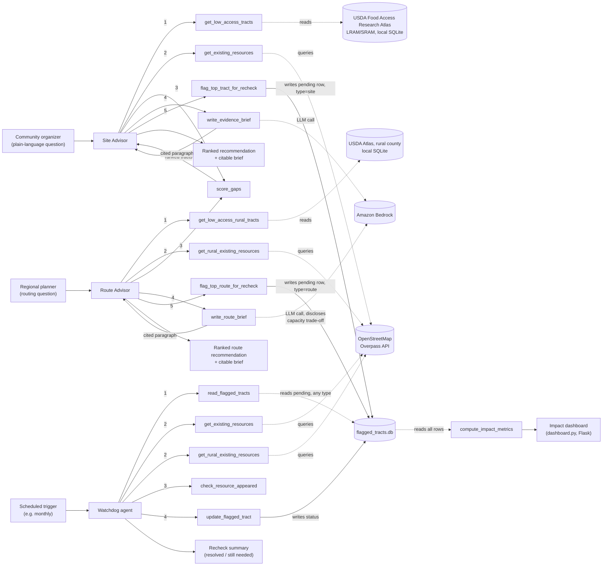

# Food-Access Advisor

A Strands Agents SDK agent for the **Agents for Humans** hackathon (Good Neighbor track).

Community leaders deciding where to put a new farm, market, or food-rescue
route usually work from instinct, not evidence — even though the evidence
already exists in public datasets nobody queries. This project maps
low-income, low-access census tracts (USDA's Food Access Research Atlas)
against what food resources already exist nearby, and answers a plain
question like *"where in Chicago would a new food resource have the
highest impact?"* with a ranked, cited recommendation.

Three agents, split by job and lifecycle, not one agent with a mode flag —
see [Guardrails](#guardrails) for why that split matters:

- **Site Advisor** (`agent.py`) — on-demand, recommends a new fixed site
  for the urban pilot city (Chicago, IL).
- **Route Advisor** (`route_advisor.py`) — on-demand, recommends a route
  or distribution-schedule change instead of a new site for the rural
  pilot county (Alexander County, IL), where a fixed-site store is often
  not viable at rural density. Scaffolded against illustrative sample
  data — see [Data setup](#data-setup).
- **Watchdog** (`watchdog_agent.py`) — scheduled, closes the loop by
  working through both Advisors' flagged tracts and reporting whether a
  resource or route change ever actually appeared/happened.

## Architecture



Only `write_evidence_brief` and `write_route_brief` call a language model.
Every other tool — `get_low_access_tracts`, `get_low_access_rural_tracts`,
`get_existing_resources`, `get_rural_existing_resources`, `score_gaps`,
`flag_top_tract_for_recheck`, `flag_top_route_for_recheck`,
`read_flagged_tracts`, `check_resource_appeared`, `update_flagged_tract`,
`compute_impact_metrics` — is deterministic: reading a local database,
calling a public API, doing arithmetic, or writing a validated row. That
split is deliberate: for a tool whose output might end up in a funding
application, "here's the exact formula" is more defensible than "the
model said so." `score_gaps` itself is shared unchanged between both
Advisors — see its use in `route_advisor.py`.

## Setup

```bash
python3 -m venv .venv && source .venv/bin/activate
pip install -r requirements.txt
```

**AWS credentials** (Strands' default model provider is Amazon Bedrock):
run `aws configure`, or copy `.env.example` to `.env` and fill in your keys.
Your credentials need `bedrock:InvokeModel` (and
`bedrock:InvokeModelWithResponseStream` if you use streaming) permission,
and you may need to request model access for Claude in the Bedrock console
first.

### Data setup

Both Advisors run out of the box against small, clearly-labeled sample
tracts (see the docstrings in `tools/access_data.py` — `_sample_tracts`
for the urban pilot city, `_sample_rural_tracts` for the rural pilot
county) so you can smoke-test the plumbing immediately. For real urban
data:

1. **USDA Food Access Research Atlas — LRAM or SRAM.** USDA discontinued
   the old standalone SNAP Retailer Locator (individual retailer points);
   what replaced it is folded into the Atlas itself as two tract-level
   products, both downloadable from
   <https://www.ers.usda.gov/data-products/food-access-research-atlas/download-the-data>:
   **LRAM** (Large Retailer Access Map — large grocery/supermarkets only,
   2019 data) is the methodological continuation of the classic Atlas and
   the recommended default, since it isolates genuine full-service grocery
   access rather than counting a dollar store as "access." **SRAM**
   (SNAP-authorized Retailer Access Map — every SNAP-authorized store
   including convenience and dollar stores, 2025 data) is more current but
   more lenient. Download either as a CSV, save it as
   `data/raw/food_access_atlas.xlsx`, then run `python data/prep_atlas.py`
   — it matches columns by pattern rather than one hardcoded spelling,
   since names have shifted across releases, and prints what it found if
   auto-matching needs a hand.
2. **OpenStreetMap** — no setup needed. Queried live via the public
   Overpass API in `tools/existing_resources.py` for community gardens,
   grocery stores, farms, and convenience stores (kept separate from real
   grocery stores in scoring — see `tools/gap_scorer.py`, a corner store
   isn't the same access as a supermarket). The rural query additionally
   looks for `social_facility=food_bank` and `amenity=marketplace`.
   Neither LRAM nor SRAM publish individual retailer coordinates, so OSM
   is this project's only point-level resource layer — that's a real gap
   worth knowing about, not a hidden one.

**Rural data is not yet wired up**: `data/prep_atlas.py` only knows how to
build the urban database (`data/atlas_pilot_city.db`) today. Building
`data/atlas_rural_county.db` from a real LRAM/SRAM download for Alexander
County, IL is the next real step for the Route Advisor — until then it
always runs on the illustrative sample rows.

To point the Site Advisor at a different city, or the Route Advisor at a
different rural county, edit `config.py` (county FIPS + bounding box) and
re-run `data/prep_atlas.py`. Nothing else in the project hardcodes a
location — that's the scalability story: the Atlas already covers every
census tract in the country.

## Run it

```bash
python agent.py
```

```
Food-Access Advisor ready — pilot city: Chicago, IL
> where's the highest-need spot for a new food resource?
```

```bash
python route_advisor.py
```

```
Route Advisor ready — rural pilot county: Alexander County, IL
> where would a route change help most?
```

Each answer also flags its top tract in `data/flagged_tracts.db` for the
Watchdog to check later. Run the Watchdog's recheck pass (normally fired on
a schedule, e.g. EventBridge — here run manually) with:

```bash
python watchdog_agent.py
```

```
Food-Access Watchdog — pilot city: Chicago, IL
Running a single unattended recheck pass over the flagged-tracts backlog...
```

It reports how many flagged tracts it checked, how many now have a nearby
resource, and how many are still needed — and updates each row accordingly.
It checks "site" (urban) rows against Chicago's live OSM data at a 1-mile
threshold, and "route" (rural) rows against Alexander County's live OSM
data at a 10-mile threshold — never the wrong region's data for either.

### Impact dashboard

The design canvas's own stated success metric — "unclosed gaps trending
down, per region, not pooled" plus "median days to resolution" — is
computed by `tools/impact_metrics.py` and served as a small live-refreshing
local dashboard:

```bash
python dashboard.py
```

Then open <http://127.0.0.1:5050>. It reads `data/flagged_tracts.db`
directly (no LLM call) and shows, separately for the urban and rural
regions: how many flagged tracts remain unclosed, how many resolved, and
the median days it took to resolve them. Auto-refreshes every 30 seconds,
so leaving it open while running the Watchdog shows the numbers move.

### Running the Watchdog on Bedrock AgentCore Runtime

`watchdog_agent.py`'s manual run above is the local/test path. To actually
host the Watchdog as the scheduled service the architecture diagram above
shows, `watchdog_agentcore_entry.py` wraps the same `build_watchdog()` in a
`BedrockAgentCoreApp` for Amazon Bedrock AgentCore Runtime:

```bash
agentcore configure --entrypoint watchdog_agentcore_entry.py --requirements-file requirements.txt
agentcore deploy
agentcore invoke '{"prompt": "Run today’s recheck pass over every pending flagged tract."}'
```

`agentcore deploy` builds an ARM64 container in the cloud via CodeBuild and
hosts it on AgentCore Runtime — no local Docker required. These commands
come from the `bedrock-agentcore-starter-toolkit` package (added to
`requirements.txt`); run `agentcore --help` to confirm current flags before
deploying, since AWS is actively evolving this tooling. This deploy step
needs your own AWS credentials and hasn't been run as part of this repo —
`watchdog_agentcore_entry.py` is verified-correct code, not a live
deployment. Actually running it on a recurring schedule (e.g. via
EventBridge) is a separate step, not yet wired up — see Roadmap.

## Test it

```bash
pytest
```

`tools/gap_scorer.py`, `tools/recheck_status.py`, `tools/flagged_tracts.py`,
`tools/impact_metrics.py`, and the deterministic parts of
`tools/access_data.py` / `tools/existing_resources.py` are pure Python
(plus SQLite for the log) with no AWS dependency — all tested directly
against temp databases or mocked HTTP calls, no credentials, no live
network required.

## Guardrails

- **Stay-in-the-pilot-region is enforced in code, not just in the prompt,
  for both Advisors.** `get_low_access_tracts` / `get_existing_resources`
  take no city/region/bounding-box arguments at all — both always resolve
  to `config.PILOT_CITY`. `get_low_access_rural_tracts` /
  `get_rural_existing_resources` are pinned the same way to
  `config.PILOT_RURAL_COUNTY`. An earlier version accepted a `city` string
  and free-form bounding-box floats that were never actually validated
  against anything, which meant the only thing stopping the model from
  answering for the wrong region was the system prompt asking it nicely.
  That's fixed: there's no argument left for the model (or a bug) to
  misuse, so the boundary holds even if the prompt is ignored, edited, or
  the model just gets it wrong. The system prompt still tells each agent
  to *say* when a question is out of scope — that's a wording/UX
  instruction now, not the only thing enforcing the boundary.
- **Site Advisor, Route Advisor, and Watchdog are three separate agents
  with disjoint tool lists, not one agent with a mode flag.** Neither
  Advisor has a tool that can write to a flagged tract's status; the
  Watchdog has no tool that can answer a siting or routing question or
  make a new recommendation. `flag_top_tract_for_recheck` (Site Advisor's
  only write) hardcodes `recommendation_type="site"` and
  `source_agent="advisor"`; `flag_top_route_for_recheck` (Route Advisor's
  only write) hardcodes `recommendation_type="route"` and
  `source_agent="route_advisor"` — neither is a model-settable argument,
  so neither Advisor can mislabel a row as coming from the other.
  `update_flagged_tract` (the Watchdog's only write) takes a fixed,
  validated status enum and writes to exactly one table — there's no
  table-name or raw-SQL argument for a model to misuse.
- **The Route Advisor's capacity trade-off is a required disclosure, not
  optional color.** A mobile route or delivery day has fixed stop
  capacity, so "add a stop here" is usually really "move a stop from
  somewhere else" — a Success-to-the-Successful risk found during the
  rural systems-thinking pass (see `docs/design-canvas.html`).
  `write_route_brief`'s own system prompt requires naming this trade-off
  explicitly in every brief; it isn't left to the orchestrator prompt to
  remember, since a content rule worth actually testing needs to live
  where the sentence a reader sees is actually generated.
- **The Watchdog checks each flagged tract against the resources and
  distance threshold that actually match its region.** A "site" row is
  checked against `get_existing_resources` (urban) at the 1-mile default;
  a "route" row is checked against `get_rural_existing_resources` (rural)
  at `RURAL_NEARBY_THRESHOLD_MILES` (10 miles) — never the other region's
  data, which would silently compare a tract to resources roughly 180
  miles away and always report "still needed" regardless of what actually
  opened nearby.
- Every answer names the USDA Food Access Research Atlas and its
  publication vintage.
- Every output is framed as decision support, not a decision — a human
  still chooses where to act.
- No personal data is involved anywhere in this pipeline — every dataset
  here is public, tract- or retailer-level, not individual-level.

## Roadmap

- **Watchdog on a real recurring schedule.** `watchdog_agentcore_entry.py`
  is deployable today, but nothing yet triggers it on a cadence — wiring
  an actual EventBridge rule to invoke the deployed AgentCore Runtime
  endpoint monthly is the next step to make the architecture diagram's
  "Scheduled trigger" real instead of manual.
- **Transit-time distance.** Straight-line miles (what's implemented now)
  understates real access — a tract "0.6 miles" from a grocery store can be
  a 40-minute bus ride away. Swapping in a GTFS feed + a routing engine
  (e.g. OSRM) for the pilot city is the single biggest accuracy upgrade
  available, and the reason this project cites transit-time distance as a
  stretch goal rather than shipping it as a guess.
- **Real rural Atlas data.** The Route Advisor's code is built and tested,
  but `data/prep_atlas.py` doesn't yet build `data/atlas_rural_county.db`
  from a real LRAM/SRAM download for Alexander County, IL — it runs on
  illustrative sample data until that's done (see Data setup above).
- **Trend forecasting.** A model trained across multiple Atlas vintages to
  flag tracts trending toward low-access before they're fully flagged.
  Academic precedent already exists for this technique, so it's the lowest
  differentiation-per-effort of the remaining items — cut first if time is
  short.

## Design docs

The systems-thinking design work behind this project (stocks/flows, the
broken loop, leverage point, guardrail rationale) lives in
[`docs/design-canvas.html`](docs/design-canvas.html) — a static export of
the working design canvas. [`docs/project-tracker.html`](docs/project-tracker.html)
is a point-in-time export of the build tracker; it's a snapshot, not a
live document, since the tracker keeps evolving after each export.

GitHub's file viewer shows these as source, not rendered pages — download
them and open locally in a browser, or enable **GitHub Pages** (Settings →
Pages → Deploy from a branch → `/docs`) to get them served as real pages
at `https://explainable-ai.github.io/food-access-advisor/design-canvas.html`
and `.../project-tracker.html`.

## License

MIT — see [LICENSE](LICENSE).
