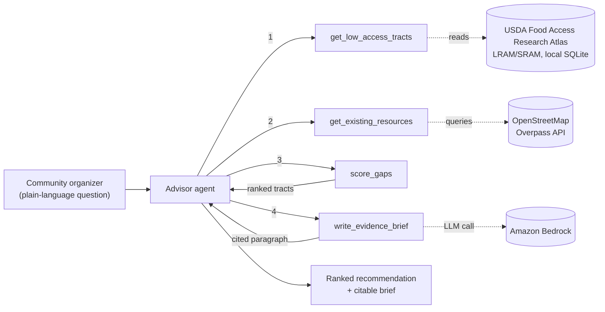

# Food-Access Advisor

A Strands Agents SDK agent for the **Agents for Humans** hackathon (Good Neighbor track).

Community leaders deciding where to put a new farm, market, or food-rescue
route usually work from instinct, not evidence — even though the evidence
already exists in public datasets nobody queries. This agent maps
low-income, low-access census tracts (USDA's Food Access Research Atlas)
against what food resources already exist nearby, and answers a plain
question like *"where in Chicago would a new food resource have the
highest impact?"* with a ranked, cited recommendation.

This is the **Advisor** — the on-demand half of the project. A second,
scheduled **Watchdog** agent (checks whether a past recommendation was ever
acted on) is the planned next piece; see [Roadmap](#roadmap) below.

## Architecture



Only `write_evidence_brief` calls a language model. `get_low_access_tracts`,
`get_existing_resources`, and `score_gaps` are deterministic — reading a
local database, calling a public API, and doing arithmetic, respectively.
That split is deliberate: for a tool whose output might end up in a funding
application, "here's the exact formula" is more defensible than "the model
said so."

## Setup

```bash
python3 -m venv .venv && source .venv/bin/activate
pip install -r requirements.txt
```

**AWS credentials** (Strands' default model provider is Amazon Bedrock):
run `aws configure`, or copy `.env.example` to `.env` and fill in your keys.
Your credentials need `bedrock:InvokeModel` (and
`bedrock:InvokeModelWithResponseStream` if you use streaming) permission,
and you may need to request model access for Claude in the Bedrock console
first.

### Data setup

The agent runs out of the box against three small, clearly-labeled sample
tracts (see the docstring in `tools/access_data.py`) so you can smoke-test
the plumbing immediately. For real data:

1. **USDA Food Access Research Atlas — LRAM or SRAM.** USDA discontinued
   the old standalone SNAP Retailer Locator (individual retailer points);
   what replaced it is folded into the Atlas itself as two tract-level
   products, both downloadable from
   <https://www.ers.usda.gov/data-products/food-access-research-atlas/download-the-data>:
   **LRAM** (Large Retailer Access Map — large grocery/supermarkets only,
   2019 data) is the methodological continuation of the classic Atlas and
   the recommended default, since it isolates genuine full-service grocery
   access rather than counting a dollar store as "access." **SRAM**
   (SNAP-authorized Retailer Access Map — every SNAP-authorized store
   including convenience and dollar stores, 2025 data) is more current but
   more lenient. Download either as a CSV, save it as
   `data/raw/food_access_atlas.xlsx`, then run `python data/prep_atlas.py`
   — it matches columns by pattern rather than one hardcoded spelling,
   since names have shifted across releases, and prints what it found if
   auto-matching needs a hand.
2. **OpenStreetMap** — no setup needed. Queried live via the public
   Overpass API in `tools/existing_resources.py` for community gardens,
   grocery stores, farms, and convenience stores (kept separate from real
   grocery stores in scoring — see `tools/gap_scorer.py`, a corner store
   isn't the same access as a supermarket). Neither LRAM nor SRAM publish
   individual retailer coordinates, so OSM is this project's only
   point-level resource layer — that's a real gap worth knowing about, not
   a hidden one.

To point this at a different city, edit `config.py` (county FIPS + bounding
box) and re-run `data/prep_atlas.py`. Nothing else in the project hardcodes
a location — that's the scalability story: the Atlas already covers every
census tract in the country.

## Run it

```bash
python agent.py
```

```
Food-Access Advisor ready — pilot city: Chicago, IL
> where's the highest-need spot for a new food resource?
```

## Test it

```bash
pytest
```

The scorer (`tools/gap_scorer.py`) is pure Python with no AWS dependency —
it's tested directly, no mocking or credentials required.

## Guardrails

- **Stay-in-the-pilot-city is enforced in code, not just in the prompt.**
  `get_low_access_tracts` and `get_existing_resources` take no city/region/
  bounding-box arguments at all — both always resolve to `config.PILOT_CITY`.
  An earlier version accepted a `city` string and free-form bounding-box
  floats that were never actually validated against anything, which meant
  the only thing stopping the model from answering for the wrong region was
  the system prompt asking it nicely. That's fixed: there's no argument
  left for the model (or a bug) to misuse, so the boundary holds even if
  the prompt is ignored, edited, or the model just gets it wrong. The
  system prompt still tells the agent to *say* when a question is out of
  scope — that's a wording/UX instruction now, not the only thing enforcing
  the boundary.
- Every answer names the USDA Food Access Research Atlas and its
  publication vintage.
- Every output is framed as decision support, not a decision — a human
  still chooses where to act.
- No personal data is involved anywhere in this pipeline — every dataset
  here is public, tract- or retailer-level, not individual-level.

## Roadmap

- **Transit-time distance.** Straight-line miles (what's implemented now)
  understates real access — a tract "0.6 miles" from a grocery store can be
  a 40-minute bus ride away. Swapping in a GTFS feed + a routing engine
  (e.g. OSRM) for the pilot city is the single biggest accuracy upgrade
  available, and the reason this project cites transit-time distance as a
  stretch goal rather than shipping it as a guess.
- **Watchdog agent.** A separately-scheduled agent that re-checks
  previously flagged tracts and reports whether a resource ever appeared —
  turning this from a one-shot recommender into a system that closes the
  loop on its own recommendation, which nothing in the prior art (food
  rescue apps, the AI-FEED research prototype) currently does.
- **Trend forecasting.** A model trained across multiple Atlas vintages to
  flag tracts trending toward low-access before they're fully flagged.
  Academic precedent already exists for this technique, so it's the lowest
  differentiation-per-effort of the three — cut first if time is short.

## License

MIT — see [LICENSE](LICENSE).
