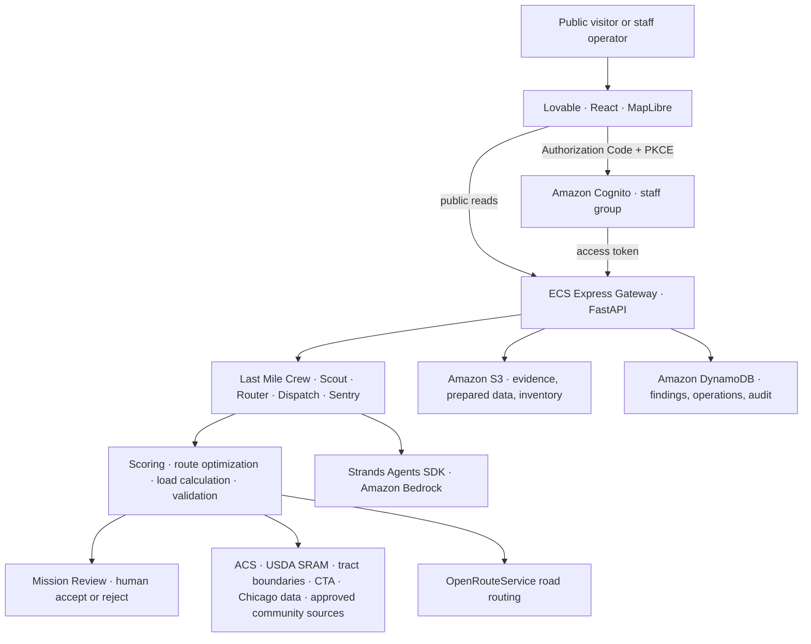

# LastMile Market — backend and agent services

LastMile Market helps mobile-grocery teams decide **where to serve, how to route a vehicle, what to load, and what changed in the community**. It combines transparent census-tract scoring, road-route planning, inventory constraints, continuously checked public evidence, and staff approval in one operational workflow.

**For:** mobile-market operators, food-access organizations, public-health teams, and regional planners.  
**Why it matters:** food-access decisions are often spread across disconnected datasets and manual planning steps. LastMile Market turns those inputs into an explainable mission while keeping every recommendation reviewable and editable by a person.

> The GitHub repository retains the engineering name `food-access-advisor`. The product is **LastMile Market**. Renaming the repository is intentionally out of scope because deployment, Lovable, and AWS integrations already depend on its current identity.

[Open the live LastMile Market app](https://lastmilemarket.lovable.app) · [API health](https://fo-a5bf5a1a8c9949e0b87db3669a6eb545.ecs.us-east-1.on.aws/health) · [API documentation](https://fo-a5bf5a1a8c9949e0b87db3669a6eb545.ecs.us-east-1.on.aws/docs) · [Frontend repository](https://github.com/explainable-ai/food-equity-navigator)

## One product, two repositories

| Repository | Responsibility |
| --- | --- |
| `food-access-advisor` (this repository) | FastAPI, the Last Mile Crew, scoring, routing, evidence monitoring, persistence, data preparation, authentication enforcement, and AWS deployment |
| [`food-equity-navigator`](https://github.com/explainable-ai/food-equity-navigator) | The React/MapLibre interface published by Lovable at `lastmilemarket.lovable.app` |

The Lovable application is not a separate demo or mock backend. It calls this API. **Brief the Crew** is the fast path; Prioritize Sites, Route Planning, Mission Review, and Access Watch expose the same agents' work as an editable control panel.

## The Last Mile Crew

| Product name | Existing implementation | Responsibility |
| --- | --- | --- |
| **Scout** | `agent.py` | Ranks Chicago and Chicagoland rural-fringe tracts using transparent evidence and adjustable weights |
| **Router** | `route_advisor.py` | Selects and sequences stops under road-time, service-time, vehicle-capacity, and maximum-stop constraints |
| **Dispatch** | `services/mission_preview.py` | Builds a reviewable mission and household-based suggested load from available inventory |
| **Sentry** | `watchdog_agent.py` | Monitors approved public sources, records evidence quality, and routes material changes to human review |

`crew_lead.py` coordinates Sentry → Scout → Router → Dispatch. Deterministic tools perform scoring, optimization, inventory arithmetic, validation, and persistence. Amazon Bedrock with the Strands Agents SDK supplies orchestration and explanation where interpretation is needed; it does not replace the auditable calculations.

## Architecture



See [Architecture](docs/ARCHITECTURE.md) for trust boundaries and request flows.

## Quick start

Requirements: Python 3.12, Git, and optional AWS CLI/Docker for live integrations.

```bash
git clone https://github.com/explainable-ai/food-access-advisor.git
cd food-access-advisor
python -m venv .venv
source .venv/bin/activate          # Windows PowerShell: .\.venv\Scripts\Activate.ps1
python -m pip install --upgrade pip
pip install -r requirements.txt
cp .env.example .env              # Windows PowerShell: Copy-Item .env.example .env
```

For local development without Cognito, set `FOOD_ACCESS_AUTH_MODE=disabled`. Never use that value in AWS.

```bash
uvicorn api.main:app --reload --host 0.0.0.0 --port 8000
```

Open <http://localhost:8000/health> and <http://localhost:8000/docs>.

```bash
pytest
```

Full local, data, Docker, AWS, Cognito, inventory, and troubleshooting instructions are in [Setup and Run — Backend API and AWS](docs/SETUP_AND_RUN.md).

## Data and explainability

- USDA 2025 SNAP-authorized Retailer Access Map (SRAM), aligned to 2020 Census tracts
- Census ACS poverty, population, household, and no-vehicle measures
- Census tract boundaries
- Greater Chicago Food Depository food-insecurity context
- CTA transportation context
- Chicago Data Portal datasets and approved community-source pages for Access Watch
- S3 inventory at `inventory/on-hand.json` and `inventory/cold-chain.json`
- OpenRouteService road directions

The site-priority score normalizes adjustable contributions for food-access gap, poverty, no-vehicle households, population served, transit burden, and existing coverage. Responses include components, point contributions, missing-evidence disclosures, and sensitivity information. Suggested loads use household-reach ranges, request constraints, available-to-promise inventory, and vehicle capacity—not an LLM guess.

## API boundary

Public/read-only routes include health, maps, tract scores, ranked tracts, resources, route planning reads, impact metrics, and approved-source status. Staff actions—including `/crew/brief`, inventory updates, mission decisions, evidence reviews, and verification—require a valid Cognito access token issued to the configured app client with membership in the `staff` group.

Production is fail-closed:

- missing or invalid token → `401`
- authenticated user outside `staff` → `403`
- required Cognito configuration missing → `503`

The browser never receives AWS credentials, routing secrets, or a Cognito client secret.

## Deployment summary

The container uses Python 3.12 and runs FastAPI with Uvicorn. CodeBuild builds the image, Amazon ECR stores it, and the ECS Express Gateway service exposes port 8000 with `/health` as the health check. The ECS task role—not the execution role—authorizes Bedrock, S3, DynamoDB, Secrets Manager, and other runtime calls.

After a backend merge:

1. Run `food-access-advisor-api-build` in CodeBuild.
2. Confirm the image was pushed to ECR.
3. Update the ECS service to the new immutable image tag or digest.
4. Wait for deployment completion and verify `/health` and `/docs`.
5. Run the smoke tests in [Setup and Run](docs/SETUP_AND_RUN.md).

## Known limitations

- Demonstration inventory and mission records are synthetic and marked `not_for_real_dispatch`.
- External public sources can be stale, incomplete, rate-limited, or unavailable. Sentry reports evidence quality and never treats a parser failure as proof of closure.
- Access Watch uses bounded, allowlisted same-site discovery. JavaScript-only sources may require a future rendered-page adapter.
- The pilot is limited to Chicago/Cook County and 72 USDA-classified rural tracts across the approved Chicagoland fringe counties.
- Every mission remains a recommendation until a staff member accepts it.

## Documentation

- [Setup and Run — Backend API and AWS](docs/SETUP_AND_RUN.md)
- [System Architecture](docs/ARCHITECTURE.md)
- [Context Engineering and Mission Memory](docs/CONTEXT_AND_MEMORY.md)
- [Direct Source Watch](deploy/DIRECT_SOURCE_WATCH.md)
- [Cognito and CORS](deploy/COGNITO_AND_CORS_SETUP.md)
- [AWS Persistence](deploy/AWS_PERSISTENCE_SETUP.md)
- [Companion frontend repository](https://github.com/explainable-ai/food-equity-navigator)

## License

[MIT](LICENSE)

