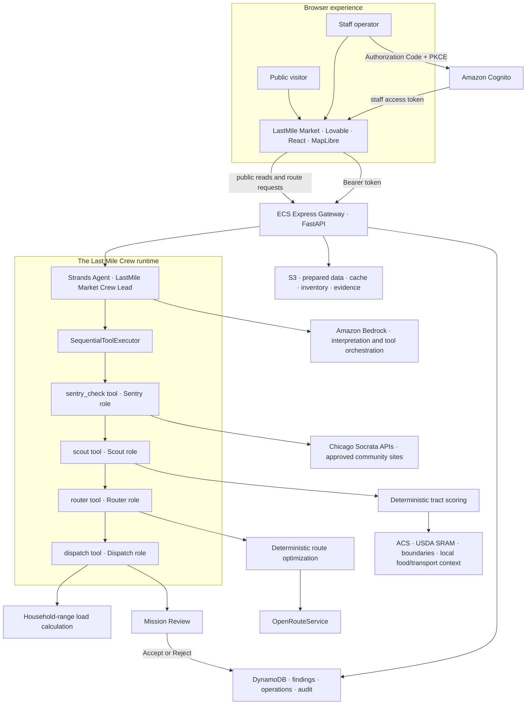

# LastMile Market Architecture

This page describes the deployed product while preserving the existing repository and internal module names.

## System view



## Trust boundaries

| Boundary | Rule |
| --- | --- |
| Public browser → API | Read-only endpoints can be public; browser input is validated by FastAPI schemas |
| Staff browser → Cognito | Authorization Code + PKCE; no client secret in the browser |
| Staff browser → protected API | Cognito access token must match the configured app client and contain `staff` group membership |
| API → AWS data services | ECS task role provides least-privilege S3/DynamoDB/Bedrock/Secrets Manager access |
| API → road-routing provider | OpenRouteService key remains server-side in Secrets Manager |
| Sentry → public sources | Only approved HTTPS sources; bounded same-host discovery; evidence-quality status retained |
| Crew → mission decision | Crew drafts; a person accepts or rejects; decision is persisted for audit |

## Agent runtime truth

The fast path is coordinated by one explicitly named Strands `Agent`: **LastMile Market Crew Lead**. It does not open conversations with four separate agent instances. The Crew Lead invokes four tool-backed roles once each in a fixed sequence:

```text
sentry_check() → scout() → router() → dispatch()
```

| Role | Fast-path implementation | Standalone Strands entry point |
| --- | --- | --- |
| Sentry | `crew_lead.sentry_check()` calls the monitoring service | `watchdog_agent.build_watchdog()`; a separate tool-free reporter can summarize results |
| Scout | `crew_lead.scout()` calls deterministic ranking | `agent.build_advisor()` |
| Router | `crew_lead.router()` calls constrained route planning | `route_advisor.build_route_advisor()` |
| Dispatch | `crew_lead.dispatch()` calls deterministic mission preparation | None; Dispatch is intentionally not a standalone `Agent` |

Scout's recorded `top_tracts` are passed to Router, and Router's recorded route is passed to Dispatch. If a stage fails or returns `no_result`, the chain stops. A deterministic fallback calls the same four stage functions directly, preserving the contract without Bedrock orchestration latency.

## Fast path and control panel

Brief the Crew and the detailed pages are two views of the same engine:

- **Brief the Crew** runs the coordinated Sentry → Scout → Router → Dispatch tool-backed fast path.
- **Prioritize Sites** exposes Scout's inputs, weights, ranked tracts, and score explanation.
- **Route Planning** exposes Router's constraints, alternatives, stop order, and road geometry.
- **Mission Review** exposes Dispatch's stop windows, suggested load, and human decision.
- **Access Watch** exposes Sentry's approved sources, evidence status, changes, and review actions.

Nothing produced by the fast path is a separate black-box answer. The detailed pages surface the same structured outputs so an operator can inspect or modify them. The product roles are presented consistently in the UI, but the documentation does not imply unsupported agent-to-agent messaging.

## Guardrails and control flow

- `SequentialToolExecutor` and the Crew Lead system prompt enforce the fixed stage order.
- Crew Lead is instructed to pass through recorded tool data and never invent, rewrite, or improve it.
- Deterministic code owns scoring, routing, household-range load calculations, inventory constraints, and readiness checks.
- FastAPI/Pydantic schemas validate browser input and stored output contracts.
- Failed and `no_result` stages terminate the chain; incomplete results are not reported as successful missions.
- Sentry retains source-health and evidence-quality status, including `partial`, `stale`, and `unavailable`.
- Cognito plus `staff` membership protect mutations and decisions.
- Human Accept/Reject remains the final mission boundary.
- Synthetic mission records remain `not_for_real_dispatch`.

## Persistence responsibilities

- **S3:** prepared scoring databases, tract artifacts, existing-resource cache, evidence objects, and `inventory/on-hand.json` plus `inventory/cold-chain.json`.
- **DynamoDB:** Sentry evidence/change state, flagged-tract verification, mission/operations records, and human decisions.
- **Browser sessionStorage:** Cognito session material and short-lived UI scenario cache only; never AWS credentials or server-side secrets.

## Scheduling and agents

The web-facing boundary remains ECS/FastAPI. Strands defines the Crew Lead and standalone Scout, Router, and Sentry agent entry points; Bedrock supports interpretation, tool orchestration, and bounded explanations. Dispatch remains deterministic. EventBridge/AgentCore components support scheduled or hosted agent execution where configured. Documentation must label a component as planned if it is not active in the target deployment.
