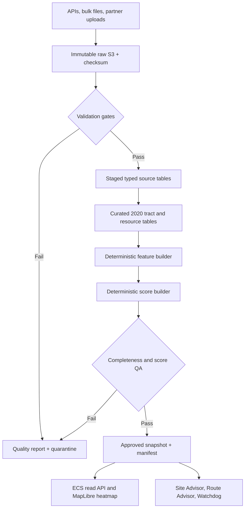

# Food Access Advisor data pipeline and lineage

## Decision

The evidence pipeline is deterministic infrastructure, not a fourth LLM agent. Site Advisor, Route Advisor, and Watchdog consume only approved, versioned evidence snapshots.

Amazon Location Service is not part of this design. MapLibre/OpenStreetMap/OpenFreeMap provide map rendering, and openrouteservice provides driving directions and matrices.

## Storage zones

The existing private evidence bucket uses these logical zones:

1. `landing/` — controlled uploads.
2. `raw/` — immutable source-native responses and files.
3. `quality/` — validation reports.
4. `quarantine/` — failed or incomplete loads.
5. `staged/` — typed source tables.
6. `curated/` — conformed geography, resources, and mobility tables.
7. `features/` — one complete scoring record per tract.
8. `scores/` — scenario scores, contributions, percentiles, ranks, and sensitivity.
9. `published/` — API- and map-ready artifacts.
10. `manifests/` — end-to-end lineage and approval records.

No failed or partial load may update `published/study_area=<area>/current.json`. The prior approved snapshot remains current until a complete candidate passes validation and staff approval.

## Lineage

Every displayed score must trace through:

`displayed score -> score artifact -> feature artifact -> curated rows -> staged rows -> immutable raw evidence`

## Approved Phase 1 scoring contract

| Component | Weight | Evidence |
|---|---:|---|
| Food-access gap | 25% | USDA FARA/SRAM |
| Poverty | 20% | ACS 2024 B17001 |
| Households without a vehicle | 15% | ACS 2024 B08201 |
| Potential reach | 20% | ACS population and approved need measures |
| Mobility burden | 10% | CNT H+T `t_80ami`, household-weighted to tract |
| Existing coverage | -10% | Verified resources plus openrouteservice road accessibility |

Missing mandatory evidence does not cause silent weight redistribution. The affected tract or snapshot remains provisional/unavailable.

## H+T gate

The three supplied ZIP files have the same SHA-256 checksum. Only one canonical file is registered. Its block-group GEOIDs must have a verified geography vintage and approved crosswalk before the tract feature can be published.

## Automation boundary

EventBridge and Step Functions should coordinate source collectors, validators, crosswalk transformations, resource deduplication, feature building, deterministic score calculation, and publication. These are workflow tasks, not agents.

The daily Watchdog is a separate follow-up loop. It rechecks flagged recommendations and does not ingest all evidence or calculate the heatmap.
